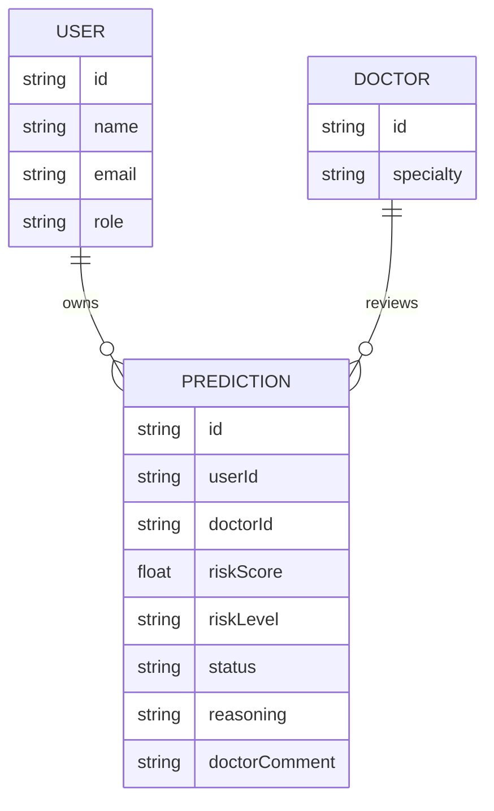
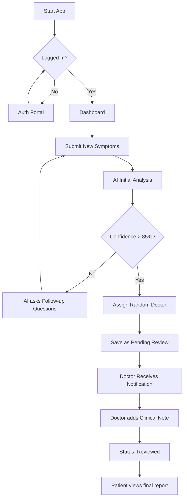
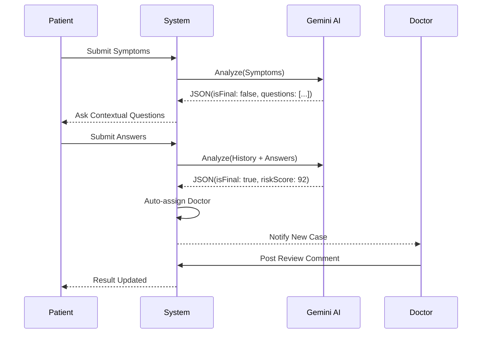

# Chapter 3: System Design and Methodology

## 3.1 Review of the Proposed System

### Overview of the Proposed System
**GaucherPredict Mobile** is an advanced, AI-driven clinical decision support system designed specifically for the early detection and screening of Gaucher Disease. The system leverages the **Google Gemini 1.5/2.0 Large Language Model (LLM)** to analyze patient symptoms (such as splenomegaly, thrombocytopenia, and bone pain) through a conversational interface. 

The system implements a dual-role portal:
1.  **Patient Portal:** Allows users to input symptoms and receive an immediate AI risk assessment.
2.  **Medical Professional Portal:** Enables assigned hematologists or geneticists to review AI findings, conduct further virtual diagnoses, and provide definitive clinical comments.

### Justification of the Proposed System
Gaucher Disease is a rare lysosomal storage disorder that is frequently misdiagnosed due to the non-specific nature of its early symptoms. Traditional diagnostic paths often take years. 
*   **Speed:** AI can process multi-organ clinical data in seconds.
*   **Accessibility:** As a mobile-first application (built with Capacitor), it brings specialist-level screening to remote areas.
*   **Human-in-the-loop:** By automatically assigning a human doctor to every high-risk case, the system ensures that AI results are always clinically validated before final patient notification.

## 3.2 System Requirements

### Hardware Requirements
| Component | Minimum Specification | Recommended Specification |
| :--- | :--- | :--- |
| **Processor** | Octa-core 1.8 GHz (Mobile) | Octa-core 2.4 GHz+ |
| **RAM** | 4 GB | 8 GB |
| **Storage** | 100 MB available space | 500 MB (for local caching) |
| **Display** | 5.5-inch Touchscreen | 6.5-inch+ OLED |
| **Connectivity** | 3G/HSPA | 4G LTE / 5G / Wi-Fi |

### Software Requirements
*   **Operating System:** Android 11+ or iOS 15+.
*   **Runtime:** Capacitor JS Bridge.
*   **Database:** LocalStorage (Prototype) / Firebase Firestore (Production).
*   **AI Engine:** Google Gemini API (via `@google/genai`).
*   **UI Framework:** React 19 with Tailwind CSS.

## 3.3 System Architecture

### Objectives of the Design
The primary objective is to create a secure, responsive, and role-segregated environment where sensitive medical data is protected while providing high-speed AI inference.

### High-Level Model Architecture
The system follows a **Serverless Client-Edge Architecture**.
*   **Client Tier:** React-based mobile UI handled by Capacitor.
*   **Logic Tier:** AI processing via Google GenAI API.
*   **Data Tier:** Local and Cloud persistence for patient records.

### System Components Design
1.  **User Interface (UI):** Designed with a "Mobile-First" approach using Lucide-React for iconography and Tailwind for adaptive layouts.
2.  **AI Orchestrator:** A service layer that manages prompt engineering and context history for the Gemini model.
3.  **Role Controller:** Ensures that data is filtered so that Doctors see only assigned cases and Patients see only their personal results.

### Logical Design Diagrams

#### Use Case Diagram
```mermaid
useCaseDiagram
    actor Patient
    actor Doctor
    actor "Gemini AI" as AI

    Patient --> (Register/Login)
    Patient --> (Submit Symptoms)
    Patient --> (Answer Follow-up Questions)
    Patient --> (View Personal Result)

    Doctor --> (Login)
    Doctor --> (View Assigned Notifications)
    Doctor --> (Conduct Clinical Review)
    Doctor --> (Provide Final Comment)

    (Submit Symptoms) ..> AI : <<include>>
    (Conduct Clinical Review) ..> (View Personal Result) : <<updates>>
```

#### Entity-Relationship Diagram (ERD)


#### System Flowchart


#### Sequence Diagram (Diagnostic Flow)


## 3.4 System Development Methodology
The system was developed using the **Agile Prototyping Methodology**. This involved:
1.  **Requirements Gathering:** Defining the clinical markers for Gaucher Disease.
2.  **Iterative UI Design:** Creating a mobile interface that simplifies complex medical data.
3.  **AI Tuning:** Refining the "System Instruction" to ensure the AI acts as a professional hematologist.

## 3.5 Programming Languages and Tools Used
*   **TypeScript:** For type-safe application logic.
*   **React 19:** Functional components and Hook-based state management.
*   **Capacitor JS:** To wrap the web application into a native mobile binary.
*   **Google Gemini API:** The core machine learning engine.
*   **Tailwind CSS:** For rapid, responsive utility-first styling.
*   **Lucide React:** For consistent medical and UI iconography.

## 3.6 Database Design
The prototype utilizes a structured JSON-based LocalStorage schema for immediate persistence.

### Data Dictionary: Predictions Table
| Field | Type | Description |
| :--- | :--- | :--- |
| `id` | String | Unique Case ID |
| `userId` | String | Foreign key to the Patient |
| `patientName`| String | Redundant for quick display |
| `status` | Enum | Pending Review / Reviewed |
| `riskLevel` | Enum | High / Medium / Low |
| `riskScore` | Number | AI Confidence Percentage |
| `doctorId` | String | Assigned Medical Professional |

## 3.7 Application Algorithm
The core diagnostic algorithm follows a **Recursive Contextual Inference** model:

**Pseudocode:**
```text
FUNCTION Start_Analysis(PatientData):
    History = []
    DO:
        Response = AI.Generate(System_Prompt, PatientData, History)
        IF Response.isFinal == TRUE:
            Score = Response.riskScore
            Level = Response.riskLevel
            Assign_Doctor()
            RETURN Final_Report
        ELSE:
            Questions = Response.questions
            Answers = User.Input(Questions)
            History.Append(Questions, Answers)
    WHILE NOT Response.isFinal
```

## 3.8 System Security
1.  **Authentication:** Implemented via role-based object identification.
2.  **Data Segregation:** Logic filters (`predictions.filter(p => p.userId === currentUserId)`) ensure patients cannot access other records.
3.  **Encrypted Transport:** All communication with the Google Gemini API is encrypted via TLS 1.3.
4.  **Clinical Governance:** AI results are marked as "Pending" until a human doctor applies a digital signature/comment, preventing unauthorized self-diagnosis errors.
